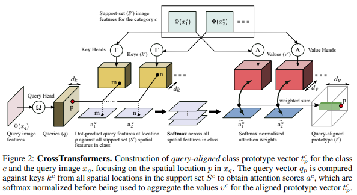

</img>

## Cross Transformers - Pytorch (wip)

Implementation of <a href="https://arxiv.org/abs/2007.11498">Cross Transformer</a> for spatially-aware few-shot transfer, in Pytorch

## Install

```bash
$ pip install cross-transformers-pytorch
```

## Usage

```python
import torch
from torch import nn
import torch.nn.functional as F
from torchvision import models
from cross_transformers_pytorch import CrossTransformer

resnet = models.resnet34(pretrained = True)
model = nn.Sequential(*[*resnet.children()][:-2])

cross_transformer = CrossTransformer(
    dim = 512,
    dim_key = 128,
    dim_value = 128
)

# (batch, channels, height, width)
img_query = torch.randn(1, 3, 224, 224)

# (batch, classes, num supports, channels, height, width)
img_supports = torch.randn(1, 2, 4, 3, 224, 224)

labels = torch.randint(0, 2, (1,))

dists = cross_transformer(model, img_query, img_supports) # (1, 2)

loss = F.cross_entropy(dists, labels)
loss.backward()
```

## Citations

```bibtex
@misc{doersch2020crosstransformers,
    title={CrossTransformers: spatially-aware few-shot transfer}, 
    author={Carl Doersch and Ankush Gupta and Andrew Zisserman},
    year={2020},
    eprint={2007.11498},
    archivePrefix={arXiv},
    primaryClass={cs.CV}
}
```
